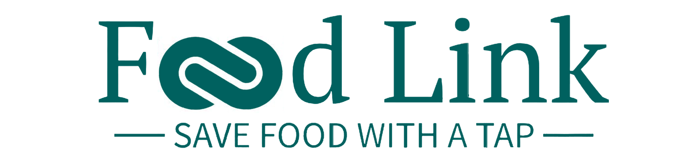

## Overview

FoodLink is a social impact platform dedicated to reducing food waste in Egypt by connecting food donors with charities. Our mission is to empower everyone to join the fight against food waste, helping to ensure that surplus food is saved and distributed to those in need.

## Technologies Used

- **Frontend**: 
  - [React](https://reactjs.org/) - A JavaScript library for building user interfaces.
  - [Axios](https://axios-http.com/) - A promise-based HTTP client for the browser and Node.js.

- **Backend**: 
  - [Node.js](https://nodejs.org/) - JavaScript runtime built on Chrome's V8 JavaScript engine.
  - [Express](https://expressjs.com/) - A web application framework for Node.js, designed for building APIs and web applications.


## Download/Setup Instructions

To run the FoodLink project locally, follow these steps:

### Prerequisites

Make sure you have the following installed on your machine:

- [Node.js](https://nodejs.org/) (v14 or higher)
- [npm](https://www.npmjs.com/) (Node Package Manager, included with Node.js)
- A local SQL database server (e.g., MySQL or MariaDB)

### Installation

1. **Clone the Repository:**
   Open your terminal and run the following command to clone the project:

   ```bash
   git clone https://github.com/your-username/your-repository-name.git

2. **In both backend and frontend folder:**

   ```bash
   npm install
3. **Start your SQL Server on your LocaHost**
4. **Create a Database with your desired name**
5. **Initiate your database using the following command:**

   ```bash
   npx nodemon server.js

6. **Congrats! Now, your frontend is linked with the backend:**

